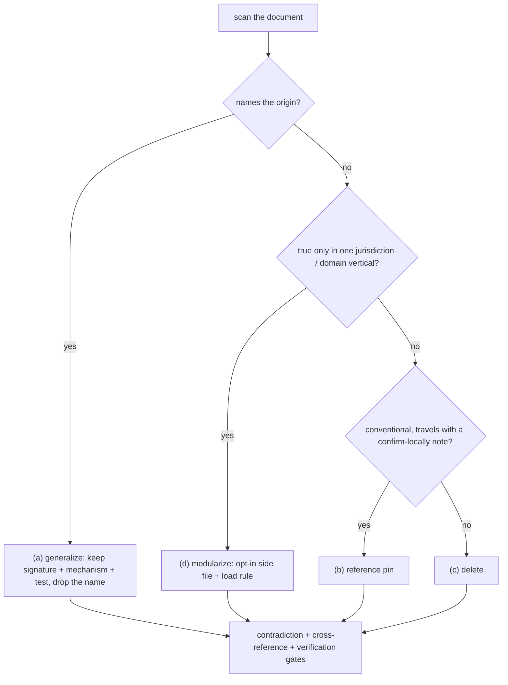

# Skill generalizer

Turn a skill that grew around one project, one source document, or one person into a
transferable method. The test of done: **a stranger with a different project can execute
the document without knowing the origin story, nothing in it names the origin, and
nothing in it assumes a jurisdiction or domain the reader never named.**

The failure it fixes: skills accrete. Each real case leaves an anecdote ("on X's artefact,
the calibration bar sat outside the clip"), a proper noun, a magic number tuned to one
artefact, a path to files that ship with one checkout, and a block of rules that only
hold in one jurisdiction. Every one of those raises the cost of the next reader and
lowers the skill's reach — while the underlying LESSON was general all along.

## The audit is a decision tree, not a rewrite

Every pass below is an independent **detector** over the skill document; every finding
gets exactly **one disposition**. Run the detectors in order, then close with the
verification gate. The audit is built for modular enhancement: when a new failure mode
appears in practice, add a detector — signature, mechanism, test, disposition — and
wire its anti-pattern; never special-case content inline.

## Workflow — a detector per pass, then verify

1. **Named-entity scan**: grep the document for capitalized proper nouns, people,
   clients, source-document and page/section identifiers, brand and trade names. Each
   hit becomes exactly one of:
   (a) a generalized rule — keep the signature, the mechanism, the detection test; drop
   the name; (b) a conditional domain convention — moved to a "reference pins" section
   with a lead line telling readers to discover local equivalents and record deviations;
   (c) deleted; or (d) modularized into an opt-in side file (pass 3). A proper noun
   survives only in the skill's own identity (name/description).
2. **Anecdote → rule**: "on X's artefact, Y happened" carries three transferable parts —
   the SIGNATURE (what it looked like), the MECHANISM (why it happens), and the TEST
   (how to detect it next time). Rewrite the anecdote as signature + mechanism + test.
   Keep numbers that generalize (ratios, tolerances, order-of-magnitude bounds);
   parameterize or delete numbers that were tuned to one artefact.
3. **Domain-modularization scan**: find blocks whose truth is locked to one jurisdiction,
   market, or domain vertical — regulations, building/fire/electrical codes, tax or
   compliance rules, label glossaries, market conventions ("saleable area includes
   balconies"). Test: would a practitioner outside that jurisdiction or vertical find
   the block wrong or irrelevant? If yes, move it to an opt-in side file —
   `references/<domain>/<code>.md` (e.g. `references/regions/sg.md`) — keeping in the
   main document only (i) the domain-GENERAL principle it instantiates ("exit-route main
   doors are commonly fire-rated self-closing by regulation — values are regional") and
   (ii) a load rule ("when the task's context names this domain, read the file and cite
   it in the ledger; if no file exists, discover locally and consider contributing
   one"). Side-file contract: fixed section skeleton, every value carrying a citation or
   a verify-locally note, a header inviting contributors to copy the structure for a new
   code, and NO method content. The main document stays trigger-neutral: loading is the
   reader's informed decision, never a side effect of triggering the skill.
4. **Constants audit**: every hard-coded number is one of — universal (schema enums, unit
   conversions, protocol contracts → keep unconditional); domain-conventional (typical
   dimensions, default heights → keep in the conventions/pins section, explicitly
   conditional); case-local (tuned to one artefact → parameterize with its rule, or
   delete).
5. **Path/reference audit**: file paths to worked examples, datasets, fixtures → either
   ship them with the skill or mark them as source-repository artefacts. The skill must
   not promise files it does not carry.
6. **Contradiction pass**: the same rule stated twice with different numbers; ordering
   claims ("run this FIRST") that conflict with another step's claim to be first;
   thresholds in mixed units without a conversion note; a module pointer whose load rule
   contradicts another pass's rule. One rule, one home, one number.
7. **Cross-reference audit**: every section the document points to must exist (including
   every side file named by a load rule); every anti-pattern should trace to a workflow
   step; every workflow step with a failure mode should have its anti-pattern. Orphans
   on either side get wired or dropped.
8. **Verification**: grep the final text for the entity list from step 1 and for path
   strings — every remaining hit is justified in one sentence or fixed. Then re-read the
   decision tree end to end as a stranger: executable without the origin, without the
   unnamed jurisdiction, without the unloaded side files? If any step says "as in the
   case of ...", it is not done.

## Side files — the modularization disposition

- **Naming**: `references/<domain>/<code>.md`, one code per file (region, market,
  vertical). The domain directory is the extension point — new codes copy an existing
  file's skeleton.
- **Load rule mandatory**: the main document must say WHEN to read the file and WHAT to
  do with it (cite in the ledger, emit as verify-locally annotations). A side file
  without a load rule is an orphan module.
- **What moves**: values, citations, label glossaries, market conventions — content that
  is true only inside the domain and load-bearing only when the context matches.
- **What never moves**: method steps, gates, tolerances, schemas, the decision tree.
  Modularizing the method fractures the skill; the side file carries the VALUES, the
  main document keeps the RULE.
- **Trigger hygiene**: side files load on the reader's informed decision (context names
  the domain), so the skill's own trigger description stays domain-neutral.

## Output contract

- The rewritten skill file.
- Any created side files, each with its load rule as wired into the main document.
- A change list: what was generalized, what was conditionalized, what was modularized,
  what was deleted — one line each.
- A residual list: items that could not be generalized without losing meaning, flagged
  for the owner.

## Anti-patterns

- Generalizing into vagueness — deleting the numbers that carry the method (tolerances,
  thresholds, conversion factors) instead of the names that carry the story.
- Keeping the origin as a "for example" clause — an example-specific aside is still
  example-specific, however labelled.
- Conditionalizing something universal (schema rules, API contracts, unit conversions) —
  those are unconditional and belong in the method body.
- Over-conditionalizing something conventional until the rule says nothing — a pin with a
  concrete number and a "confirm locally" lead is transferable; "varies by region" is not.
- Modularizing the method — side files are for domain-locked values and citations; a
  gate, tolerance, or workflow step exiled to a side file is a skill fractured.
- Side files without a load rule — an orphan module is dead weight the reader never
  finds, and an uncited regulation is worse than none.
- Renaming the skill or its directory as part of generalizing — identity is separate
  from specificity; changing the id breaks every reference to the skill.
