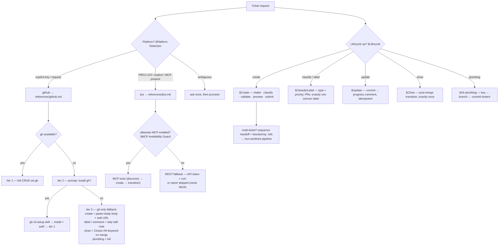

# ticketing-skill

One skill for the whole ticket lifecycle on **GitHub Issues** or **JIRA** —
create, classify/label, update from commits, close post-merge, and the
ticket-key ↔ branch ↔ commit plumbing that ties tickets to git.

Consolidates six former skills (#599): `ticket-creation-skill`,
`git-issue-labeler-skill`, `git-issue-updater-skill`,
`jira-git-integration-skill`, `jira-status-updater-skill`,
`jira-ticket-labeler-skill`. The method lives in
[`SKILL.md`](SKILL.md); platform values live in
[`references/github.md`](references/github.md) and
[`references/jira.md`](references/jira.md).

## Workflow

## What stays outside

| Concern | Owner |
|---|---|
| Branches, PLANs, execution, PR pipeline | `worktree-pipeline-skill` |
| Oversized-work planning as decision tickets | `wayfinder-skill` |
| Batch dev→uat promotion | `dev-uat-promotion-skill` |
| Semver definitions, version bump, tagging, releases | `semantic-release-convention-skill` + release tooling |

This skill labels; it never versions. PRs get exactly one semver label
(`major`/`minor`/`patch`) derived from the PR title's Conventional Commit
prefix; issues get type + priority.

## Extending to another platform

Copy a side file's skeleton to `references/<platform>.md` — values only
(commands, vocabularies, key formats, endpoints), no method content. The
main skill routes unknown platforms through detect-and-ask.
